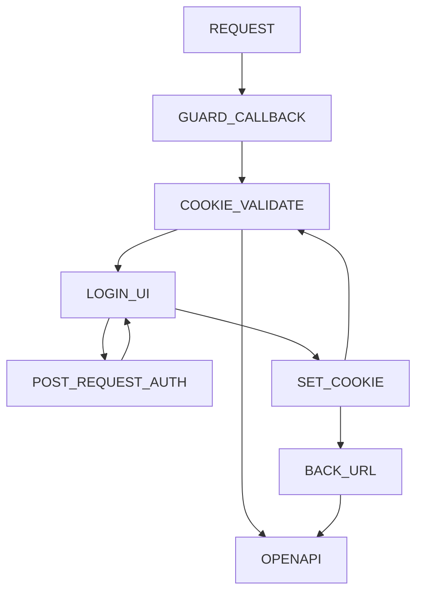

<p align="center">
  <a href="https://www.npmjs.com/package/@femike/swagger-protect" target="blank"></a>
</p>
<p align="center">
<a href="https://www.npmjs.com/org/femike"></a>
<a href="https://www.npmjs.com/org/femike"></a>
<a href="https://www.npmjs.com/org/femike"></a>
<!-- <a href="#"></a> -->
<a href="https://yoomoney.ru/to/41001486944398/250"></a>
</p>

## Description

A small tool to protect access to the openapi user interface. Creates a mechanism for checking the request URL: `/ api / *` and checks for the existence of a Cookie `swagger_token`, if a cookie is present, checks its validity through a callback, in case of failure, redirects to the authorization page `/login-api/index.html?backUrl=/path/to/openapi/ui`. After successful authorization, returns the user by `backUrl`.

## Installation

```bash
$ npm install @femike/swagger-protect
```

```bash
$ yarn add @femike/swagger-protect
```

### Swagger protect Fastify hook

Easy way to protect swagger with fastify use a hook.

```typescript
// ./src/main.ts
import { fastifyProtectSwagger } from '@femike/swagger-protect'
import { getConnection } from 'typeorm'
import { TokenEntity } from 'your-application/src/entities'

// With clean fastify application
fastify.addHook(
  'onRequest',
  fastifyProtectSwagger({
    cookieGuard: (
      token, // must return boolean result (token: string) => Promise<boolean> for example typeorm find token on fail return false
    ) =>
      getConnection()
        .getRepository(TokenEntity)
        .findOneOrFail(token)
        .then(t => t.token === token),
    cookieKey: 'swagger_token', // key must be stored in cookies on login.
    entryPath: '/api', // entry point will be protect with guard above.
    redirectPath: '/login-api', // redirect on fail guard.
  }),
)

// For NestJS With Fastify Adapter
fastifyAdapter.getInstance().addHook(
  'onRequest',
  fastifyProtectSwagger({
    cookieGuard: token =>
      getConnection()
        .getRepository(TokenEntity)
        .findOneOrFail(token)
        .then(t => t.token === token),
    cookieKey: 'swagger_token',
    entryPath: '/api',
    redirectPath: '/login-api',
  }),
)
```

When guard return `true`, hook go to the next way and show swagger open api page.

If guard return `false`, user will be redirected to the page /login-api

Your must create frontend application with sign-in form and set cookie with `swagger_token` key setted above on succesfuly login or use `@femike/swager-protect-ui` see below.

### Swagger protect Express middleware

Cookie-parser must be import and used as middleware.

```typescript
// ./src/main.ts
import { expressProtectSwagger } from '@femike/swagger-protect'
import express from 'express'
import { createSwagger } from './swagger'
import cookieParser from 'cookie-parser' // cookie-parser must be import!
const app = express()

app.get('/', (req, res) => res.send('Home Page <a href="/api">API</a>'))

async function bootstrap() {
  app.use(cookieParser())
  app.use(
    expressProtectSwagger({
      guard: (token: string) => !!token,
    }),
  )
  createSwagger(app).listen(3000, () => {
    console.log(`Application is running on: ${undefined}`)
  })
}
bootstrap()
```

### Swagger protect NestJS Module

```typescript
// $ touch ./src/swagger/swagger.guard.ts

import type { SwaggerGuardInterface } from '@femike/swagger-protect'
import { Inject } from '@nestjs/common'
import { AuthService } from '../auth'

/**
 * Swagger Guard
 */
export class SwaggerGuard implements SwaggerGuardInterface {
  constructor(@Inject(AuthService) private readonly service: AuthService) {}

  /**
   * Method guard
   */
  async canActivate(token: string): Promise<boolean> {
    return await this.service.method(token)
  }
}
```

Example `guard` must be implements from `SwaggerGuardInterface`

```typescript
// $ touch ./src/swagger/swagger.login.ts
import {
  SwaggerProtectLogInDto,
  SwaggerLoginInterface,
} from '@femike/swagger-protect'
import { Inject } from '@nestjs/common'
import { AuthService } from '../auth'

/**
 * Swagger Login
 */
export class SwaggerLogin implements SwaggerLoginInterface {
  constructor(@Inject(AuthService) private readonly service: AuthService) {}
  async execute({
    login,
    password,
  }: SwaggerProtectLogInDto): Promise<{ token: string }> {
    return this.service
      .signIn({ login, passwrd })
      .then(value => (value ? { token: value.token } : { token: '' }))
  }
}
```

Example `login` service must be implements from `SwaggerLoginInterface`

```typescript
// ./src/app.module.ts

import { LoggerModule } from '@femike/logger'
import { Module } from '@nestjs/common'
import { SwaggerProtect } from '@femike/swagger-protect'

@Module({
  imports: [
    LoggerModule,
    SwaggerProtect.forRootAsync({
      imports: [AuthModule],
      useFactory: () => ({
        guard: SwaggerGuard,
        logIn: SwaggerLogin,
        swaggerPath: '/api/*',
      }),
    }),
  ],
  controllers: [AppController],
  providers: [HttpStrategy, AppService, AppLogger],
})
export class AppModule {}
```

If `useUI` options is not disabled module creates controller with answered path `/login-api` on `GET` request redirect to static `index.html` UI on `POST` passed data to callback function or injected class implemented from `SwaggerLoginInterface` response pass data to UI where on success setted Cookie.



## API Spec

The `forRoot()` method takes an options object with a few useful properties.

| Property       | Type             | Description                                                                                                                                     |
| -------------- | ---------------- | ----------------------------------------------------------------------------------------------------------------------------------------------- |
| `guard`        | Function / Class | Function or Class guard must be return boolean result. Class meight be implement `SwaggerGuardInterface`. Default: `(token: string) => !!token` |
| `logIn`        | Function / Class | Function or Class logIn must return object with key token. Class meight be implement `SwaggerLoginInterface`. Default: `() => ({ token: '' })`  |
| `swaggerPath?` | string           | Path where answered swagger ui. Default: `/api/*`                                                                                               |
| `loginPath?`   | string           | Path where user will be redirect on fail guard. Default `/login-api`                                                                            |
| `cookieKey?`   | string           | Key name stored in Cookie. Default `swagger_token`                                                                                              |
| `useUI?`       | Boolean          | Use or not user interface for login to swagger ui. When loginPath was changed from `/login-api` ui will be disabled. Default `true`             |

## Examples

See full examples [https://github.com/femike/swagger-protect/tree/main/samples](https://github.com/femike/swagger-protect/tree/main/samples).

## UI

### Installation

```bash
$ npm i @femike/swagger-protect-ui
```

```bash
$ yarn add @femike/swagger-protect-ui
```

Default url `/login-api` UI have no settings, it must be only disabled by options `useUI`: `false` in `forRoot()` or `forRootAsync()`
Form send `POST` request to `/login-api` with data `{ login, password }` on response set Cookie with default key `swagger_token`

<p align="center">
</img>
</p>

## Roadmap

- [x] Fastify Hook

- [x] Express Middleware

- [x] NestJS Module

- [x] [UI - login](https://www.npmjs.com/package/@femike/swagger-protect-ui)

- [x] [Example Page UI](https://femike.github.io/swagger-protect-ui/)

- [ ] sample fastify

- [x] sample express

- [x] sample nestjs express

- [x] sample nestjs fastify

- [ ] tests e2e samples

- [ ] units tests

- [ ] inject swagger ui layout
