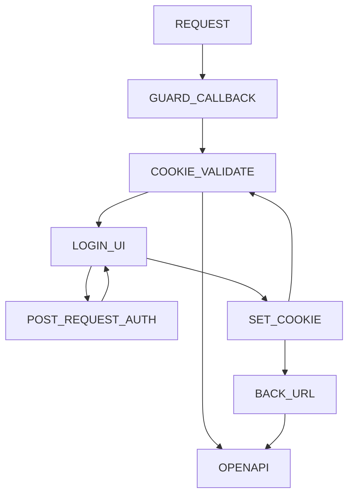

<p align="center">
  <a href="https://www.npmjs.com/package/@femike/swagger-protect" target="blank"></a>
</p>
<p align="center">
<a href="https://www.npmjs.com/org/femike"></a>
<a href="https://www.npmjs.com/org/femike"></a>
<a href="https://www.npmjs.com/org/femike"></a>
<a href="https://www.npmjs.com/org/femike"></a>
<a href="https://www.npmjs.com/org/femike"></a>
<a href="https://www.npmjs.com/org/femike"></a>
<!-- <a href="#"></a> -->
<a href="https://yoomoney.ru/to/41001486944398/250"></a>
</p>

# :bookmark_tabs:

- [Fastify Hook](#swagger-protect-fastify-hook)
- [Express Middleware](#swagger-protect-express-middleware)
- [NestJS For Express](#swagger-protect-nestjs-module-for-express)
- [NestJS For Fastify](#swagger-protect-nestjs-module-for-fastify)
- [API Spec](#api-spec)
- [Examples](#examples)
- [UI Module](#user-interface)
- [Known Issues](#known-issues)
- [Roadmap](#roadmap)

## Description

A small tool to protect access to the openapi user interface. Creates a mechanism for checking the request URL: `/ api / *` and checks for the existence of a Cookie `swagger_token`, if a cookie is present, checks its validity through a callback, in case of failure, redirects to the authorization page `/login-api/index.html?backUrl=/path/to/openapi/ui`. After successfuly authorization, returns to the `backUrl`.

### Versions compability

- `^2.0.1` Supports: **Express** `v4.17`, **Fastify** `v3`, **NestJS** `v7`- `v8`
- `^9.0.3` Supports: **Express** `v4.18`, **Fastify** `v4`, **NestJS** `v9`

## Installation

```bash
npm install @femike/swagger-protect@^2.0.1 # or @^9.0.3 for nestjs v9
```

```bash
yarn add @femike/swagger-protect@^2.0.1
```

### Swagger protect Fastify hook

[:small_red_triangle:up](#bookmark_tabs "Up to menu")

Easy way to protect swagger with fastify use a hook.

```typescript
// ./src/main.ts
import { fastifyProtectSwagger } from '@femike/swagger-protect'
import { getConnection } from 'typeorm'
import { TokenEntity } from 'your-application/src/entities'

// With clean fastify application
fastify.addHook(
  'onRequest',
  fastifyProtectSwagger({
    guard: (
      token, // must return boolean result (token: string) => Promise<boolean> for example typeorm find token on fail return false
    ) =>
      getConnection()
        .getRepository(TokenEntity)
        .findOneOrFail(token)
        .then(t => t.token === token),
    cookieKey: 'swagger_token', // key must be stored in cookies on login.
    swaggerPath: 'api', // entry point will be protect with guard above.
    loginPath: '/login-api', // redirect on fail guard.
  }),
)
// For NestJS With Fastify as Adapter hook for module see below.
fastifyAdapter.getInstance().addHook(
  'onRequest',
  fastifyProtectSwagger({
    guard: token =>
      getConnection()
        .getRepository(TokenEntity)
        .findOneOrFail(token)
        .then(t => t.token === token),
    cookieKey: 'swagger_token',
    swaggerPath: /^\/api\/(json|static\/index.html)(?:\/)?$/,
    loginPath: '/login-api',
  }),
)
```

When guard return `true`, hook go to the next way and show swagger open api page.

If guard return `false`, user will be redirected to the page `/login-api`

> **Note** Your must create frontend application with sign-in form and set cookie
> with `swagger_token` key setted above on succesfuly login.

> Or use `@femike/swager-protect-ui` see [below](#user-interface).

### Swagger protect Express middleware

[:small_red_triangle:up](#bookmark_tabs "Up to menu")

> **Warning** Cookie-parser must be import before setup protect middleware.

```typescript
// ./src/main.ts
import { expressProtectSwagger } from '@femike/swagger-protect'
import express from 'express'
import { createSwagger } from './swagger'
import cookieParser from 'cookie-parser'
const app = express()

app.get('/', (req, res) => res.send('Home Page <a href="/api">API</a>'))

async function bootstrap() {
  app.use(cookieParser()) // @!important need set cookie-parser before setup protect middleware
  expressProtectSwagger({
    guard: (token: string) => !!token, // if token exists access granted!
  })
  createSwagger(app).listen(3000, () => {
    console.log(`Application is running on: http://localhost:3000`)
  })
}
bootstrap()
```

### Swagger protect NestJS Module for Express

[:small_red_triangle:up](#bookmark_tabs "Up to menu")

> **Warning** `Express` have no methods override exists routes, we must register middleware before setup `Swagger`.

```typescript
// touch ./src/swagger/config.ts
import { registerExpressProtectSwagger } from '@femike/swagger-protect'
import type { INestApplication } from '@nestjs/common'
import { DocumentBuilder, SwaggerModule } from '@nestjs/swagger'
import { SwaggerGuard } from './guard'

export const SWAGGER_PATH = 'api'

const options = new DocumentBuilder()
  .setTitle('Cats example')
  .setDescription('The cats API description')
  .setVersion('1.0')
  .addTag('cats')
  .addBearerAuth()
  .build()

export function createSwagger(app: INestApplication): INestApplication {
  registerExpressProtectSwagger(app, {
    guard: new SwaggerGuard(),
    swaggerPath: SWAGGER_PATH,
    loginPath: '/login-api',
    cookieKey: 'swagger_token',
  })
  const document = SwaggerModule.createDocument(app, options)
  SwaggerModule.setup(SWAGGER_PATH, app, document)
  return app
}
```

> **Note** Parrameters `guard`, `swaggerPath` `loginPath` and `cookieKey` have no effect in module `SwaggerProtect` when we using `Express`.

```typescript
// ./src/main.ts
import { SwaggerProtect } from '@femike/swagger-protect'
import { Module } from '@nestjs/common'
import { CatsModule } from './cats/cats.module'
import { SwaggerLogin } from './swagger'

@Module({
  imports: [
    CatsModule,
    SwaggerProtect.forRoot({
      guard: () => false, // no effect on express
      logIn: new SwaggerLogin(),
      swaggerPath: 'api', // no effect on express
      loginPath: '/login-api', // no effect on express
      cookieKey: 'swagger_token', // no effect on express
    }),
  ],
})
export class AppModule {}
```

```typescript
// $ touch ./src/swagger/swagger.login.ts
import {
  SwaggerProtectLogInDto,
  SwaggerLoginInterface,
} from '@femike/swagger-protect'
import { v4 as uuid } from 'uuid'

/**
 * Swagger Login
 */
export class SwaggerLogin implements SwaggerLoginInterface {
  async execute({
    login,
    password,
  }: SwaggerProtectLogInDto): Promise<{ token: string }> {
    return login === 'admin' && password === 'changeme'
      ? { token: uuid() }
      : { token: '' }
  }
}
```

Example `login` service must be implemented from `SwaggerLoginInterface`

### Swagger protect NestJS Module for Fastify

[:small_red_triangle:up](#bookmark_tabs "Up to menu")

Create class `guard` must be implemented from `SwaggerGuardInterface`

```typescript
// $ touch ./src/swagger/swagger.guard.ts

import type { SwaggerGuardInterface } from '@femike/swagger-protect'
import { Inject } from '@nestjs/common'
import { AuthService } from '../auth'

/**
 * Swagger Guard
 */
export class SwaggerGuard implements SwaggerGuardInterface {
  constructor(@Inject(AuthService) private readonly service: AuthService) {}

  /**
   * Method guard
   */
  async canActivate(token: string): Promise<boolean> {
    return await this.service.method(token)
  }
}
```

Now register module `SwaggerProtect`

> **Note** `Fastify` middleware give little bit more than `Express`, `swaggerPath` meight be `RegExp` It can protect not only `swagger openapi UI`.

> **Warning** But remember if you override this option you must protect two entry points `/api/json` and `/api/static/index.html` in this `RegExp`

```typescript
// ./src/app.module.ts

import { LoggerModule } from '@femike/logger'
import { Module } from '@nestjs/common'
import { SwaggerProtect } from '@femike/swagger-protect'

@Module({
  imports: [
    LoggerModule,
    SwaggerProtect.forRootAsync<'fastify'>({
      // <- pass
      imports: [AuthModule],
      useFactory: () => ({
        guard: SwaggerGuard,
        logIn: SwaggerLogin,
        swaggerPath: /^\/api\/(json|static\/index.html)(?:\/)?$/,
        useUI: true, // switch swagger-protect-ui
      }),
    }),
  ],
  controllers: [AppController],
  providers: [HttpStrategy, AppService, AppLogger],
})
export class AppModule {}
```

> **Warning** The controller `login-api` uses `ClassSerializer` you have to add `ValidationPipe` and container for fallback errors.

```typescript
// ./src/main.ts

  ...

    app.useGlobalPipes(
    new ValidationPipe({
      transform: true,
      disableErrorMessages: false,
      enableDebugMessages: true,
    }),
  )
  useContainer(app.select(AppModule), { fallbackOnErrors: true })

  ...

```

> **Note** If `useUI` options is not disabled, module creates controller with answered path `/login-api` on `GET` request redirect to static `index.html` `UI` on `POST` request passed data to callback function or injected class implemented from `SwaggerLoginInterface` response return data to `UI` where on success set `Cookie`.



## API Spec

[:small_red_triangle:up](#bookmark_tabs "Up to menu")

The `forRoot()` method takes an options object with a few useful properties.

| Property       | Type             | Description                                                                                                                                       |
| -------------- | ---------------- | ------------------------------------------------------------------------------------------------------------------------------------------------- |
| `guard`        | Function / Class | Function or Class guard must be return boolean result. Class meight be implemented `SwaggerGuardInterface`. Default: `(token: string) => !!token` |
| `logIn`        | Function / Class | Function or Class logIn must return object with key token. Class meight be implemented `SwaggerLoginInterface`. Default: `() => ({ token: '' })`  |
| `swaggerPath?` | string / RegExp  | Default: RegExp `/^\/api(?:\/\|-json\|\/json\|\/static.+\|\/swagger.+)?$/` for `fastify`                                                          |
| `loginPath?`   | string           | Path where user will be redirect on fail guard. Default `/login-api`                                                                              |
| `cookieKey?`   | string           | Key name stored in Cookie. Default `swagger_token`                                                                                                |
| `useUI?`       | Boolean          | Use or not user interface for login to swagger ui. When loginPath was changed from `/login-api` ui will be disabled. Default `true`               |

## Examples

[:small_red_triangle:up](#bookmark_tabs "Up to menu")

> **Note** See full examples on `Github` [@femike/swagger-protect/tree/main/samples](https://github.com/femike/swagger-protect/tree/main/samples)
>

## UI Module {#user-interface}

[:small_red_triangle:up](#bookmark_tabs "Up to menu")

### Installation ui module

```bash
npm i @femike/swagger-protect-ui
```

```bash
yarn add @femike/swagger-protect-ui
```

Default url: `/login-api`

> **Note** UI have no settings, it can be only disabled with options `useUI`: `false` in `forRoot()` or `forRootAsync()`
> Form send `POST` request to `/login-api` with data `{ login, password }` on response set Cookie with default key `swagger_token`

<p align="center">
</img>
</p>

## Known Issues

[:small_red_triangle:up](#bookmark_tabs "Up to menu")

> **Warning** If you want to use global prefix dont forget set exclude path `login-api`

```ts
app.setGlobalPrefix('api/v1', {
  exclude: ['login-api'],
})
```

## Roadmap

[:small_red_triangle:up](#bookmark_tabs "Up to menu")

- [x] Fastify Hook
- [x] Express Middleware
- [x] NestJS Module
- [x] [UI - login](https://www.npmjs.com/package/@femike/swagger-protect-ui)
- [x] [Example Page UI](https://femike.github.io/swagger-protect-ui/)
- [x] Sample fastify
- [x] Sample express
- [x] Sample nestjs fastify
- [x] Tests e2e nest-fastify
- [x] Tests e2e nest-express
- [x] Tests e2e express
- [x] Tests e2e fastify
- [x] Units test replaceApi
- [ ] Units tests
- [x] Github CI
- [ ] Inject Swagger UI Layout
